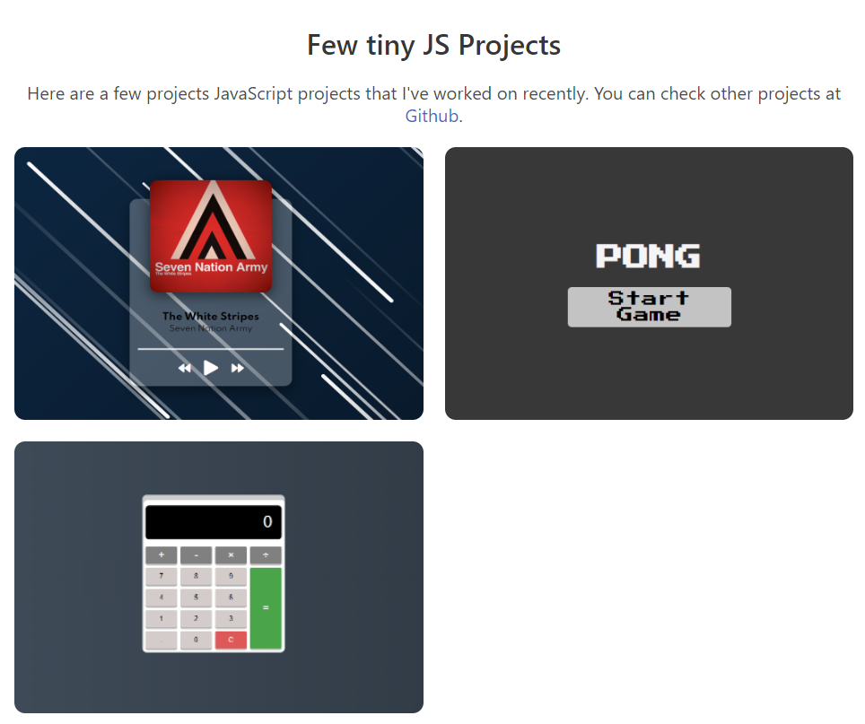
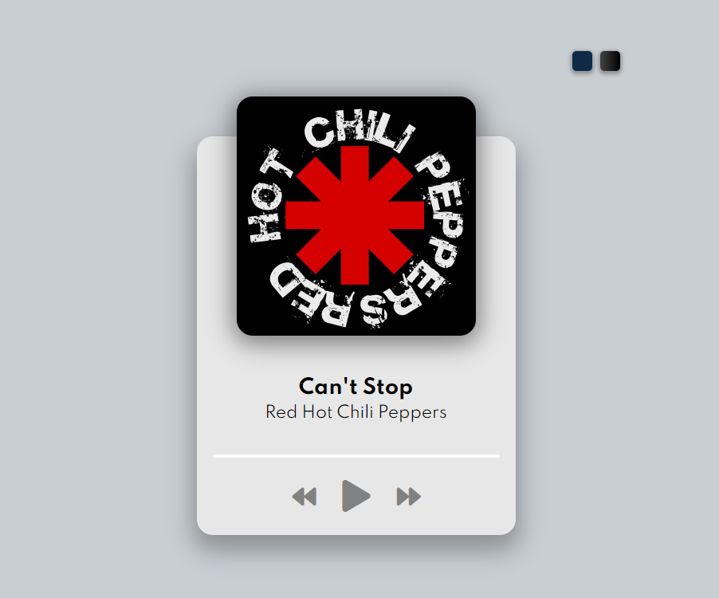
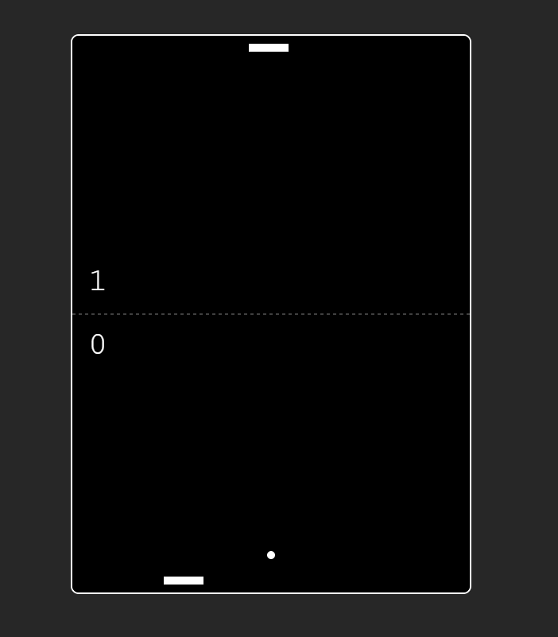

<br />
<div align="center">
 

  <h3 align="center">Multiple JS Projects</h3>

</div>
# Getting started
1.  Clone the repository
```
git clone https://github.com/jfilipeferreira96/multiple-js-projects.git
```

2. You can now run the project by opening index.html

   
<p align="right">(<a href="#top">back to top</a>)</p>

<!-- ABOUT THE PROJECT -->

# About The Project

<p align="center">



<p align="right">(<a href="#top">back to top</a>)</p>


## Project 1 - Music Player
A basic music player created using this documentation https://developer.mozilla.org/en-US/docs/Web/HTML/Element/audio

I might later on add a repeat button and some other features such as a navigation bar containing the full playlist.
### Features

- Music player with 3 different themes.
- Play, pause, next, previous track.



## Project 2 - Pong Game
This was my first time using canvas. It is fairly simple to create the layout for this game. However, making the ball moving and the computer "AI" was quite challenging and I required some external aid.



## Project 3 - Calculator


<p align="right">(<a href="#top">back to top</a>)</p>
